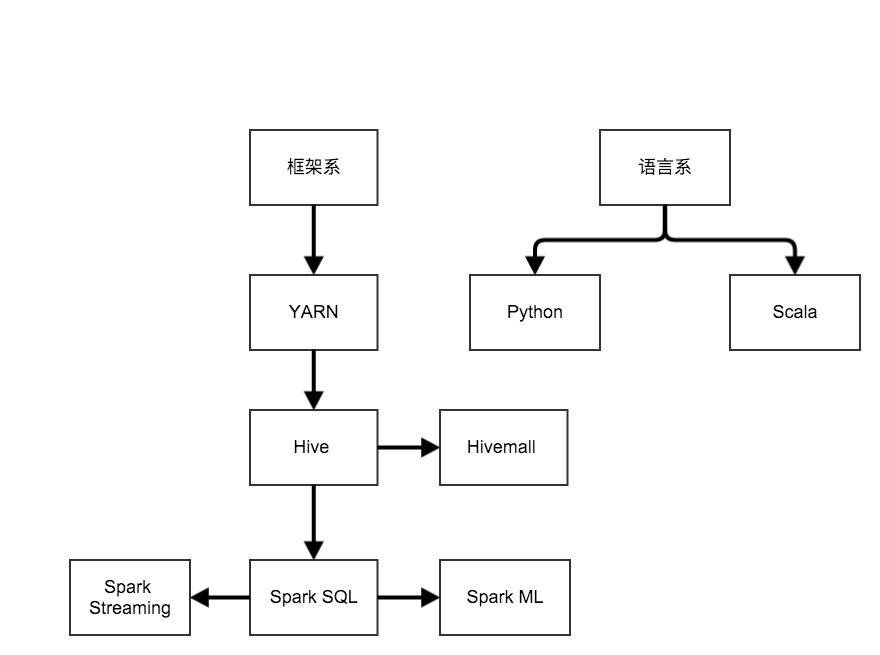

# 2016计划

搞大数据也有一年多的时间, 虽然已经有了些入门, 但并没有太深入, 所以2016年的主线还是继续积累和加深技术栈。

## 读书计划

* 大数据日知录__架构与算法
* Hadoop技术内幕:深入解析YARN架构设计与实现原理
* Spark技术内幕:深入解析Spark内核架构设计与实现原理
* 深入理解Java虚拟机:JVM高级特性与最佳实践
* Spark机器学习
* 集体智慧编程
* Head First 设计模式

后续待加

## 博客计划

每周至少一篇原创博客

## 技能天赋树

* 上半年主要学习Yarn和Hive
* 下半年主要学习Spark

本文完

* 原创文章，转载请注明： 转载自[Lamborryan](<lamborryan.github.io>)，作者：[Ruan Chengfeng](<http://lamborryan.github.io/about/>)
* 本文链接地址：http://lamborryan.github.io/2016-plan
* 本文基于[署名2.5中国大陆许可协议](<http://creativecommons.org/licenses/by/2.5/cn/>)发布，欢迎转载、演绎或用于商业目的，但是必须保留本文署名和文章链接。 如您有任何疑问或者授权方面的协商，请邮件联系我。
