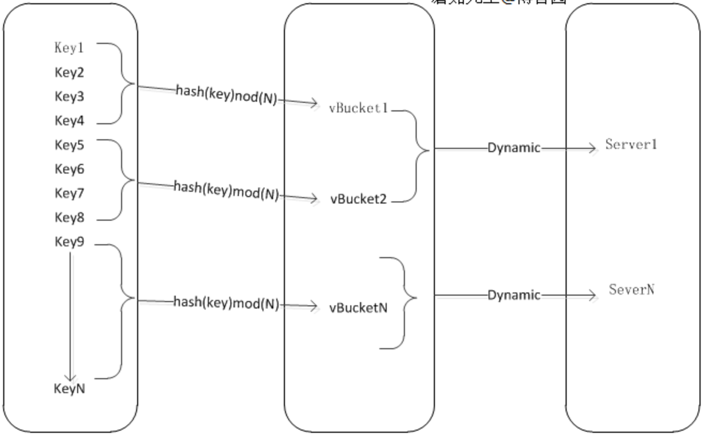
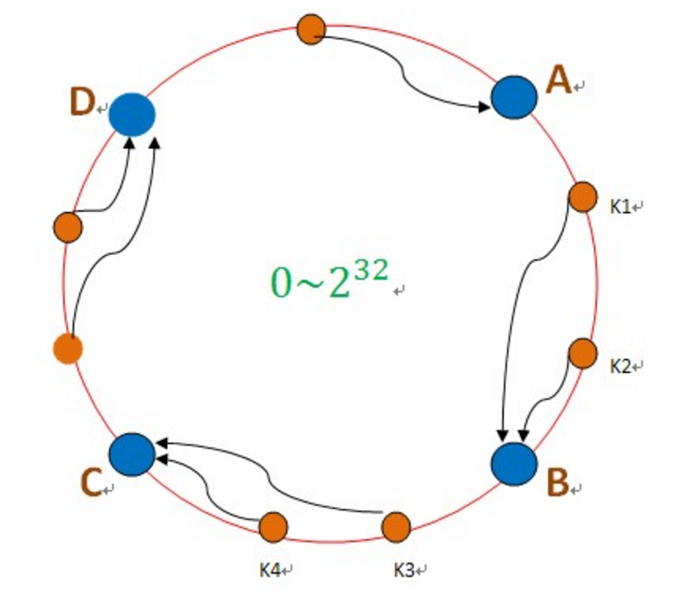
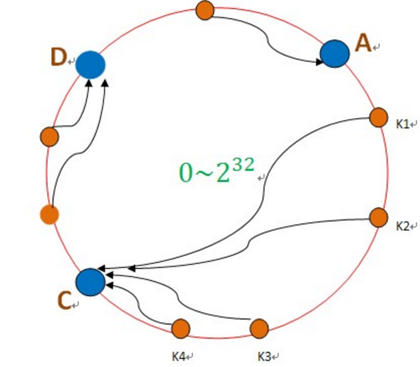
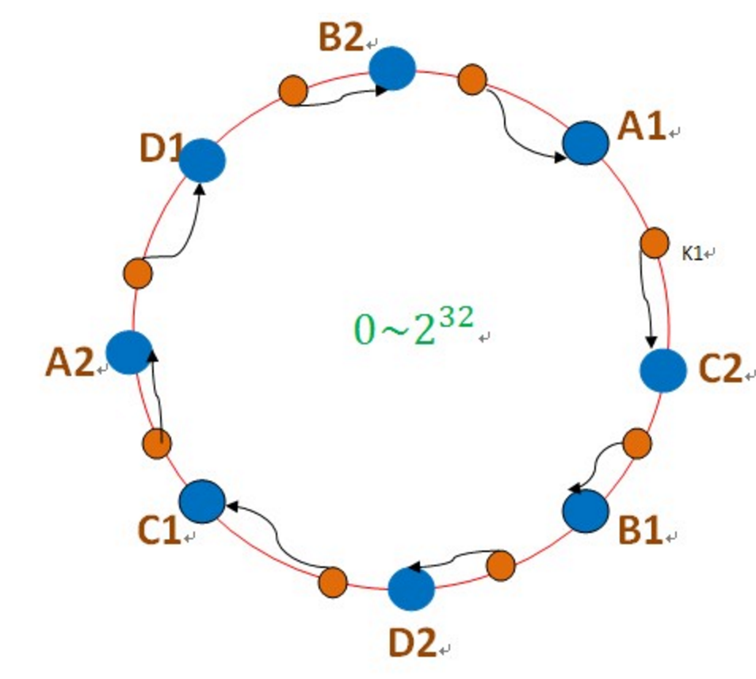

## 一.引言

大数据相比于一些传统的并行数据库系统一个很大的特点就是可以横向扩展(Scale Out)，即通过增加机器数目来实现水平扩展。 而支持这一特性的背后就用到了数据的切分与路由。对于海量的数据，通过数据分片来将数据切分并分配到各个机器中, 数据分片后, 如何能够找到某条记录的存储空间就必然成为了新的问题, 这就是数据路由。
现今的分布式系统上所使用的分片和路由算法基本上都是哈希分片和范围分片为主, 本文主要介绍常用的几个经典哈希分片和范围分片。

## 二.哈希分片

### 1.Round Robin

#### 算法简介

Round Robin算法就是市面上非常流行的哈希取模算法。假设有k台物理机, 通过以下哈希函数即可实现分片:

* H(Key) = hash(key) mod K

对物理机进行编号从0到k－1，根据上述哈希函数，对于以key为主键的某个纪录，H(key)即为存储数据的物理机编号, 通过这种方式也可以根据key找到这条纪录在哪台物理机上。

```python
def getPartition(key,num):
    return getHash(key) % num
```

#### 缺点
当需要增加物理节点或者删除物理节点时候，哈希函数就变为:

* H(Key) = hash(key) mod (K + 1)
* H(Key) = hash(key) mod (K - 1)

这时原先存在的key与物理节点的映射关系就彻底打乱了, 原先存下的数据的不能跟key访问到, 需要对所有的数据按照现有的哈希函数重新生成, 非常缺乏灵活性。

造成Round Robin 缺乏灵活的本质就是将key-partition与partition-map写在了同一哈希函数上。

### 2.Virtual Buckets (虚拟桶)

虚拟桶是取模和一致性hash二者的折中办法:
* 采用固定节点数量，来避免取模的不灵活性。
* 采用可配置映射节点，来避免一致性hash的部分影响。



它将key-partition与partition-map分成两步:

##### key对虚拟桶层(key-partition)

虚拟桶层采用预设固定数量，假设预设N=1024, 意味之后这个分布式集群最大扩容到1024个节点，带来的好处就是mod后的值是不变的(非常重要)，这保证了第一层映射不受实际节点变化的影响。

##### 虚拟桶层到实际节点(partition-map)

举个例子，项目刚开始使用时配置节点映射：

* Server1对应桶的编号为0到500。
* Server2对应桶的编号为500到1024。

当增加新节点之后, 需要重新分配节点对虚拟桶的映射。
比如增加Server3后新的节点映射为:

* Server1对应桶的编号为0到400。
* Server2对应桶的编号为600到1024.
* Server3对应桶的编号为400到600。

由此可见, 增加节点对key映射到虚拟桶层是完全没有影响的。但是, 增加节点后400-600的数据还分别存在Server1和Server2上，映射还没发完法命中。

因此需要在节点增加完全前, 把Server1和Server2中400到600的数据复制到Server3上，完成新的虚拟桶到实际节点映射表的更新后, 再删除Server1和Server2中400到600的数据。当然这过程中有可能造成的数据一致性问题, 暂不考虑。

该算法尽量减少了增加删除节点对原有系统的影响，降低了数据的迁移量。

### 3.Consistent Hashing (一致性哈希)

把数据用hash函数（如MD5），映射到一个很大的空间里，如图所示。数据的存储时，先得到一个hash值，对应到这个环中的每个位置，如k1对应到了图中所示的位置，然后沿顺时针找到一个机器节点B，将k1存储到B这个节点中。



如果B节点宕机了，则B上的数据就会落到C节点上，如下图所示：



这样，只会影响C节点，对其他的节点A，D的数据不会造成影响。然而，这又会造成一个“雪崩”的情况，即C节点由于承担了B节点的数据，所以C节点的负载会变高，C节点很容易也宕机，这样依次下去，这样造成整个集群都挂了。

为此，引入了“虚拟节点”的概念：即把想象在这个环上有很多“虚拟节点”，数据的存储是沿着环的顺时针方向找一个虚拟节点，每个虚拟节点都会关联到一个真实节点，如下图所使用：



图中的A1、A2、B1、B2、C1、C2、D1、D2都是虚拟节点，机器A负载存储A1、A2的数据，机器B负载存储B1、B2的数据，机器C负载存储C1、C2的数据。由于这些虚拟节点数量很多，均匀分布，因此不会造成“雪崩”现象。

## 三.范围分片 (Range Partition)

范围分片首先将所有记录的主键进行排序, 然后在排序好的主键空间里将记录划分为数据分片, 每个数据分片存储有序的的主键空间片段内的所有记录。

在实现具体存储系统时候, 往往保持数据分片的映射表, 记录表每一项记载数据分片的最小主键及其对应的物理机地址。

## 四.总结

对比以上几个常用的算法不难发现:

1. Round Robin 实现简单，但是不灵活, 一旦出现增加或删除节点, 数据变动比较大.
2. 一致性哈希, 比较灵活但是实现复杂，维护成本较高.
3. 虚拟桶是在Round Robin和一致性哈希之间的折中.
4. 范围分片容易造成热点现象,从而影响负载均衡。

### 引用:

[《探索C#之虚拟桶分片》](http://www.cnblogs.com/mushroom/archive/2015/05/31/4542772.html)

[《一致性哈希与java实现》](http://www.blogjava.net/hello-yun/archive/2012/10/10/389289.html)

本文完


* 原创文章，转载请注明： 转载自[Lamborryan](<lamborryan.github.io>)，作者：[Ruan Chengfeng](<http://lamborryan.github.io/about/>)
* 本文链接地址：http://lamborryan.github.io/bigdata-split-and-route
* 本文基于[署名2.5中国大陆许可协议](<http://creativecommons.org/licenses/by/2.5/cn/>)发布，欢迎转载、演绎或用于商业目的，但是必须保留本文署名和文章链接。 如您有任何疑问或者授权方面的协商，请邮件联系我。
