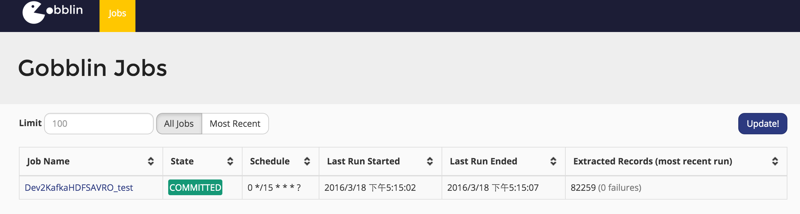
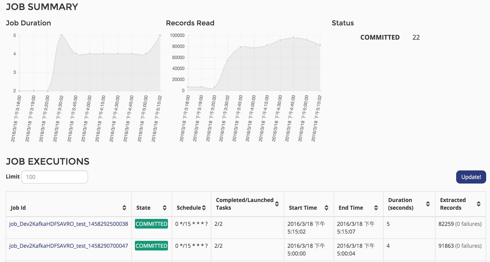
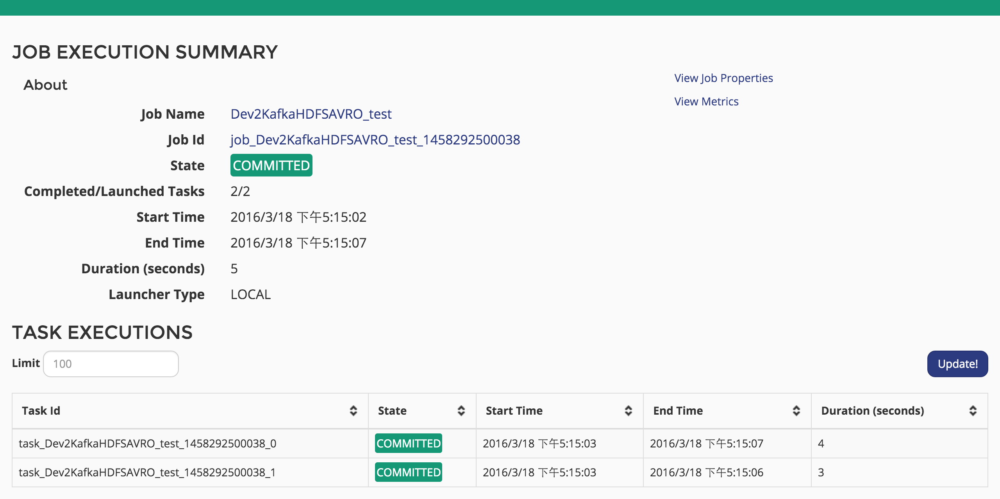

## 简介

在阅读Gobblin的时候突然发现Gobblin其实是自带一个Admin Server以及History Store来存放历史的job运行数据, 所以也就研究了下这块内容。 这也反应了Gobblin的一个缺点即文档和资料的缺乏, 不过还好有源码。

## History Store

History Store的内容在[\<Gobblin文档\>](https://github.com/linkedin/gobblin/wiki/Job%20Execution%20History%20Store)里有介绍, 代码对应gobblin-metastore package.

History Store 数据是存放在mysql上，所以需要在配置中加入以下内容:

* job.history.store.enabled=true
* job.history.store.url=jdbc:mysql://data1/gobblin?createDatabaseIfNotExist=true
* job.history.store.jdbc.driver=com.mysql.jdbc.Driver
* job.history.store.user=gobblin
* job.history.store.password=gobblin

但是配置完以后并不能立马就实现, 这是因为gobblin不会自动生成元数据表, 这一点有点挫.

所以需要手动建立gobblin数据库, 然后再在gobblin数据库内建相应的表。关于表的字段请自己看文档。

* gobblin_job_executions
* gobblin_task_executions
* gobblin_job_metrics
* gobblin_task_metrics
* gobblin_job_properties
* gobblin_task_properties

好在, gobblin-metastore package自带了建表的sql: gobblin_job_history_store.sql。

这样每次执行完job, job的status和metrix就会保存在gobblin数据库里, 这位Admin Server来监控数据提供了先觉条件。

## Admin Server

### Web Ui

有了History Admin, 那么我们可以通过Admin Server来监控历史job的运行状况。默认情况下是不启动Admin Server, 我们来看下源码。跟Admin Server有关的package有以下几个

* gobblin-admin: admin 管理界面, 包括server和client. Admin Server是基于jetty运行的, 通过与rest server来获取具体数据;
* gobblin-rest-server: rest server是一个运行Rest.li的服务, 主要处理请求以及history store查询;
* gobblin-rest-api: Rest api, 暂不介绍。
* gobblin-rest-client: Rest.li 客户端, 与Rest Server交互获取job执行信息。

由此可见要进行admin 监控, 至少需要启两个服务:admin Server, rest server 并配置开启history store.

``` java
public SchedulerDaemon(Properties defaultProperties, Properties customProperties)
    throws Exception {
  Properties properties = new Properties();
  properties.putAll(defaultProperties);
  properties.putAll(customProperties);

  List<Service> services = Lists.<Service>newArrayList(new JobScheduler(properties));
  boolean jobExecInfoServerEnabled = Boolean
      .valueOf(properties.getProperty(ConfigurationKeys.JOB_EXECINFO_SERVER_ENABLED_KEY, Boolean.FALSE.toString()));
  if (jobExecInfoServerEnabled) {
    JobExecutionInfoServer executionInfoServer = new JobExecutionInfoServer(properties);
    services.add(executionInfoServer);
    if (shouldRunAdminServer(properties)) {
      services.add(new AdminWebServer(properties, executionInfoServer.getServerUri()));
    }
  }
  this.serviceManager = new ServiceManager(services);
}
```

在SchedulerDaemon里面会启动2个server, JobExecutionInfoServer, AdminWebServer 分别对应rest server和 admin server, 而要启动这两个server需要有相应的配置job.execinfo.server.enabled和admin.server.enabled，默认都是关闭的.

* admin.server.enabled=true
* admin.server.port=17878
* job.execinfo.server.enabled=true
* rest.server.host=data4
* rest.server.host=18080

Gobblin的Rest Server是基于linkin的Rest.li开发的, 所以url还是有点奇怪的:

* http://<hostname:port>/jobExecutions/idType=JOB_NAME&id.string=TestJobName&limit=10

最后说明下, admin server的js库和css库有部分是被墙的, 所以web生成速度很慢, 需要把这些js库下载下来添加到本地。

### client

同样我们可以通过gobblin-admin.sh 来查看job信息:

```bash
[bmw@data4 bin]$ sh gobblin-admin.sh --logdir ./ help
gobblin-admin.sh [JAVA_OPTION] COMMAND [OPTION]
Where JAVA_OPTION can be:
  --fwdir <fwd dir>                              Gobblin's dist directory: if not set, taken from ${GOBBLIN_FWDIR}
  --logdir <log dir>                             Gobblin's log directory: if not set, taken from ${GOBBLIN_LOG_DIR}
  --jars <comma-separated list of job jars>      Job jar(s): if not set, ${GOBBLIN_FWDIR/lib} is examined
  --help                                         Display this help and exit
COMMAND is one of the following:
  jobs|tasks
And OPTION are any options associated with the command, as specified by the CLI.
[bmw@data4 bin]$ sh gobblin-admin.sh --logdir ./ jobs -list
Job Name                State      Last Run Started     Last Run Completed   Schedule        Last Run Records Processed  Last Run Records Failed
Dev2KafkaHDFSAVRO_test  COMMITTED  2016-03-18T17:30:00  2016-03-18T17:30:04  0 */15 * * * ?          21157.249109155135                      0.0
```

## 总结

最后展示下效果web的效果吧:

### 展示所有的job(相同的job只显示一个)



### 展示job的所有历史记录



### 展示某个job实例的detail信息, 可查看task, properties[View Job Properties]和metrix[View Metrics]




本文主要介绍了如何配置实现gobblin的web监控以及history store。总体来说, 这个监控做的还是不错的。
下一篇将简要介绍gobblin-runtime。

本文完
