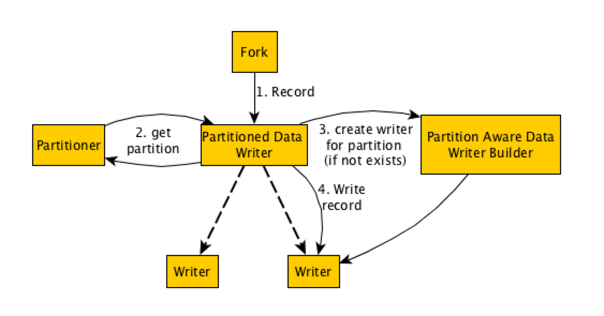

# Gobblin系列六之Writer源码分析

## 简介

Gobblin的writer功能还是很强大的, 该Stage负责将record写入临时文件中。由于项目的需要, 要求把每天的kafka日志按照日期按天输出到不同的目录。所以花了一天时间研究了Writer的源码和流程。

## 流程简述



* PartitionedDataWriter是整个过程的中心，它负责链接partitioner, PartitionAwareDataWriterBuilder,和writer.
* partitioner负责计算每一个record的partition.
* PartitionedDataWriter会在内存中创建LoadingCache<k,v>,存放partition和writer的哈希映射，PartitionAwareDataWriterBuilder负责为那些还没存放在内存的partition创建writer。
* writer负责进行数据落地，即对同一partition的records调用其对应的writer写入数据。

> 注意 不管有没有需要partition, Gobblin的writer都是从PartitionedDataWriter开始,可以把不需要分区这种情况理解为只有一个分区。

接下来让我们根据源码来展开整个过程吧

## PartitionedDataWriter

#### PartitionedDataWriter的初始化

Writer流程得从上一篇文章[<Gobblin系列四之Runtime初探>](http://lamborryan.github.io/gobblin-runtime-view/)上谈起。
Writer是在fork.class中processRecords方法通过buildWriterIfNotPresent创建的, 那么我们先从这里开始查看源码。

``` java
private void buildWriterIfNotPresent() throws IOException {
  if (!this.writer.isPresent()) {
    try {
      this.writer = Optional.of(this.closer.register(buildWriter()));
    } catch (SchemaConversionException sce) {
      throw new IOException("Failed to build writer for fork " + this.index, sce);
    }
  }
}
/**
 * Build a {@link gobblin.writer.DataWriter} for writing fetched data records.
 */
private DataWriter<Object> buildWriter()
    throws IOException, SchemaConversionException {
  DataWriterBuilder<Object, Object> builder = this.taskContext.getDataWriterBuilder(this.branches, this.index)
      .writeTo(Destination.of(this.taskContext.getDestinationType(this.branches, this.index), this.taskState))
      .writeInFormat(this.taskContext.getWriterOutputFormat(this.branches, this.index))
      .withWriterId(this.taskId)
      .withSchema(this.convertedSchema.orNull())
      .withBranches(this.branches)
      .forBranch(this.index);

  return new PartitionedDataWriter<>(builder, this.taskContext.getTaskState());
}
```

从上述代码上看出, 一切的writer都开始于PartitionedDataWriter. 看看这个名字就可以看出gobblin默认就支持分区输出, 所以心里就放松了大半, 这个功能不需要花太大精力开发了。那么接下来就是分析PartitionedDataWriter这个class了。

#### PartitionedDataWriter的基类

DataWriter做为interface定义了实现writer所需要实现的方法, 而PartitionedDataWriter继承了DataWriter,

``` java
public interface DataWriter<D> extends Closeable {

  /**
   * Write a source data record in Avro format using the given converter.
   *
   * @param record data record to write
   * @throws IOException if there is anything wrong writing the record
   */
  public void write(D record)
      throws IOException;

  /**
   * Commit the data written.
   *
   * @throws IOException if there is anything wrong committing the output
   */
  public void commit()
      throws IOException;

  /**
   * Cleanup context/resources.
   *
   * @throws IOException if there is anything wrong doing cleanup.
   */
  public void cleanup()
      throws IOException;

  /**
   * Get the number of records written.
   *
   * @return number of records written
   */
  public long recordsWritten();

  /**
   * Get the number of bytes written.
   *
   * @return number of bytes written
   */
  public long bytesWritten()
      throws IOException;
}
```

#### PartitionedDataWriter的具体实现

PartitionedDataWriter他的代码还是比较简单的, 主要分为以下几个功能:

1.如果配置文件指定了writer.partitioner.class这个属性, 那么就创建这个partitioner的实例, 负责对record的分区。如果没有设置该属性,就意味着不需要进行分区,所以所有的record都分在一个partitioner中。

``` java
if (state.contains(ConfigurationKeys.WRITER_PARTITIONER_CLASS)) {
  // 如果设置了writer.partitioner.class属性则根据该类创建partitioner
  Preconditions.checkArgument(builder instanceof PartitionAwareDataWriterBuilder,
      String.format("%s was specified but the writer %s does not support partitioning.",
          ConfigurationKeys.WRITER_PARTITIONER_CLASS, builder.getClass().getCanonicalName()));

  try {
    this.shouldPartition = true;
    // 创建dataWriterBuilder，后续生成dataWriter
    this.builder = Optional.of(PartitionAwareDataWriterBuilder.class.cast(builder));
    // 创建partitionner
    this.partitioner = Optional.of(WriterPartitioner.class.cast(
        ConstructorUtils.invokeConstructor(Class.forName(state.getProp(ConfigurationKeys.WRITER_PARTITIONER_CLASS)),
            state, builder.getBranches(), builder.getBranch())));
  } catch (ReflectiveOperationException roe) {
    throw new IOException(roe);
  }
} else {
  // 如果没有设置了writer.partitioner.class, 则用NON_PARTITIONED_WRITER_KEY来表示只有一个partitioner
  this.shouldPartition = false;
  InstrumentedDataWriterDecorator<D> writer =
      this.closer.register(new InstrumentedDataWriterDecorator<D>(builder.build(), state));
  this.partitionWriters.put(NON_PARTITIONED_WRITER_KEY, writer);
  this.partitioner = Optional.absent();
  this.builder = Optional.absent();
}
```

所以需要在.pull配置writer.partitioner.class=gobblin.core.writer.partitioner.TimeBasedJsonWriterPartitioner来告诉gobblin按照TimeBasedJsonWriterPartitioner的规则进行partition

2.设置分区后, 在内存中以LoadingCache<k,v>存放record的partition和其对应的writer.

``` java

private final LoadingCache<GenericRecord, DataWriter<D>> partitionWriters;

this.partitionWriters = CacheBuilder.newBuilder().build(new CacheLoader<GenericRecord, DataWriter<D>>() {
      @Override
      public DataWriter<D> load(final GenericRecord key) throws Exception {
        return closer
            .register(new InstrumentedPartitionedDataWriterDecorator<D>(createPartitionWriter(key), state, key));
      }
    });
```
> 上述代码实现了回调, 当partitionWriters.get(key)时, 如果没有key,则通过load来创建新的writer

3.为新的record partition创建writer。

``` java
private DataWriter<D> createPartitionWriter(GenericRecord partition) throws IOException {
  if (!this.builder.isPresent()) {
    throw new IOException("Writer builder not found. This is an error in the code.");
  }
  return this.builder.get().forPartition(partition).withWriterId(this.baseWriterId + "_" + this.writerIdSuffix++)
      .build();
}
```

writer的创建分为两步:

* 根据partition, 创建PartitionAwareDataWriterBuilder, 即this.builder.get().forPartition(partition)返回partition对应的PartitionAwareDataWriterBuilder
* 调用PartitionAwareDataWriterBuilder的build创建DataWriter

``` java
public abstract class PartitionAwareDataWriterBuilder<S, D> extends DataWriterBuilder<S, D> {

  protected Optional<GenericRecord> partition = Optional.absent();

  public PartitionAwareDataWriterBuilder<S, D> forPartition(GenericRecord partition) {
    this.partition = Optional.fromNullable(partition);
    return this;
  }

  public abstract boolean validatePartitionSchema(Schema partitionSchema);
}

```

关于PartitionAwareDataWriterBuilder的介绍请看文档[Partitioned Writers ](https://github.com/linkedin/gobblin/wiki/Partitioned%20Writers) ,结合它来看本文更容易理解。


例如以下的simpleWriterBuilder:

``` java
public class SimpleDataWriterBuilder extends FsDataWriterBuilder<String, byte[]> {
  @Override
  public DataWriter<byte[]> build() throws IOException {
    return new SimpleDataWriter(this, this.destination.getProperties());
  }
}
```

所以需要.pull文件中指定writer.builder.class=gobblin.writer.SimpleDataWriterBuilder来告诉gobblin我需要通过SimpleDataWriter来进行datawriter

4.writer 和 commit

``` java
@Override
public void write(D record) throws IOException {
  try {

    // 使用partitioner来计算record的partition
    GenericRecord partition =
        this.shouldPartition ? this.partitioner.get().partitionForRecord(record) : NON_PARTITIONED_WRITER_KEY;

    // 根据partition获取datawriter, 如果没有相应的datawriter则创建一个新的datawriter
    DataWriter<D> writer = this.partitionWriters.get(partition);

    // 调用datawriter的writer进行record的writer
    writer.write(record);
  } catch (ExecutionException ee) {
    throw new IOException(ee);
  }
}

@Override
public void commit() throws IOException {
  int writersCommitted = 0;
  for (Map.Entry<GenericRecord, DataWriter<D>> entry : this.partitionWriters.asMap().entrySet()) {
    try {
      // 对所有的datawriter调用commit
      entry.getValue().commit();
      writersCommitted++;
    } catch (Throwable throwable) {
      log.error(String.format("Failed to commit writer for partition %s.", entry.getKey()), throwable);
    }
  }
  if (writersCommitted < this.partitionWriters.asMap().size()) {
    throw new IOException("Failed to commit all writers.");
  }
}
```

由此可见PartitionedDataWriter的writer和commit都是根据record的partition获取其对应的writer然后进行write和commit。 只不过在进行writer的时候如果还没该partition时会调用createPartitionWriter为该partition创建相应的writer。

至此关于PartitionedDataWriter的代码逻辑就介绍的差不多了。

## partition

所有partition.class都继承自接口WriterPartitioner, 他实现两个功能:

``` java

public interface WriterPartitioner<D> {

  // partition的结构,
  public Schema partitionSchema();

  // 根据record计算partition
  public GenericRecord partitionForRecord(D record);

}
```

Gobblin默认支持时间为key的分区, 它实现了一个abstract class TimeBasedWriterPartitioner, 我们只需要根据自己的需要继承这个类做相应的开发就行了。比如我的record是json格式的, 那么我需要继承得到自己的实现类TimeBasedJsonWriterPartitioner.(Gobblin通过继承TimeBasedWriterPartitioner实现了TimeBasedAvroWriterPartitioner, 即对应record格式是avro的)

接下来让我们看看TimeBasedWriterPartitioner是怎么实现的以上两个方法的。

1.partitionForRecord方法

``` java

@Override
 public GenericRecord partitionForRecord(D record) {
   // 虚函数，需要我们自己写解析方法, 即根据record的格式解析出里面的时间字段。
   long timestamp = getRecordTimestamp(record);

   // 按照partitionSchema方法产生的Schema封装timestamp为GenericRecord
   GenericRecord partition = new GenericData.Record(this.schema);
   if (!Strings.isNullOrEmpty(this.writerPartitionPrefix)) {
     partition.put(PREFIX, this.writerPartitionPrefix);
   }
   if (!Strings.isNullOrEmpty(this.writerPartitionSuffix)) {
     partition.put(SUFFIX, this.writerPartitionSuffix);
   }

   if (this.timestampToPathFormatter.isPresent()) {
     String partitionedPath = getPartitionedPath(timestamp);
     partition.put(PARTITIONED_PATH, partitionedPath);
   } else {
     DateTime dateTime = new DateTime(timestamp, this.timeZone);
     switch (this.granularity) {
       case MINUTE:
         partition.put(Granularity.MINUTE.toString(), dateTime.getMinuteOfHour());
       case HOUR:
         partition.put(Granularity.HOUR.toString(), dateTime.getHourOfDay());
       case DAY:
         partition.put(Granularity.DAY.toString(), dateTime.getDayOfMonth());
       case MONTH:
         partition.put(Granularity.MONTH.toString(), dateTime.getMonthOfYear());
       case YEAR:
         partition.put(Granularity.YEAR.toString(), dateTime.getYear());
     }
   }

   return partition;
 }

 // 虚函数，需要我们自己写解析方法, 即根据record的格式解析出里面的时间字段。
 public abstract long getRecordTimestamp(D record);
```

2.partitionSchema方法

``` java

this.schema = getSchema();

private Schema getSchema() {
  if (this.timestampToPathFormatter.isPresent()) {
    return getDateTimeFormatBasedSchema();
  } else {
    return getGranularityBasedSchema();
  }
}

@Override
public Schema partitionSchema() {
  return this.schema;
}

```

该段代码的意思就是根据writer.partition.granularity这个配置项来组合Schema, 比如我设置了writer.partition.granularity=DAY.就返回Granularity.DAY.toString()

最后附上我的实现类TimeBasedJsonWriterPartitioner怎么实现getRecordTimestamp

``` java

/**
 *  Check if the partition column value is present and is a Long object. Otherwise, use current system time.
 */
private long getRecordTimestamp(Optional<Object> writerPartitionColumnValue) {

    return writerPartitionColumnValue.orNull()  instanceof Long ? (Long) writerPartitionColumnValue.get()
            : System.currentTimeMillis();
}

@Override
public long getRecordTimestamp(byte[] record) {

    return getRecordTimestamp(getWriterPartitionColumnValue(record));
}


/**
 * Retrieve the value of the partition column field specified by this.partitionColumns
 */
private Optional<Object> getWriterPartitionColumnValue(byte[] record){
    if (!this.partitionColumns.isPresent()) {
        return Optional.absent();
    }

    Optional<Object> fieldValue = Optional.absent();

    for (String partitionColumn : this.partitionColumns.get()) {
        JSONObject jsonObject = new JSONObject(new String(record));
        fieldValue = Optional.of(jsonObject.get(partitionColumn));
        if(fieldValue.isPresent()){
            return fieldValue;
        }
    }

    return fieldValue;
}

```

上述代码实现了以下功能:

* 根据配置writer.partition.columns获取字段名
* 解析json格式的record, 获取writer.partition.columns字段对应的时间戳
* 如果json解析失败则返回当前时间的时间戳。

比如我设置了writer.partition.columns=timestamp

> 我们需要writer.partition.timezone=Asia/Shanghai这个配置来指定时区,否则会出错。

## DataWriter

Gobblin默认实现了SimpleDataWriter和AvroHDFSDataWriter, 它们都继承了FsDataWriter, FsDataWriter继承了DataWriter.

SimpleDataWriter将byte[]格式的record写入到文件系统(本地或者hdfs), 而AvroHDFSDataWriter则将avro格式的record写入到文件系统中.

以SimpleDataWriter为例, record被写入到stageFile目录中。

``` java
@Override
public void write(byte[] record) throws IOException {
  Preconditions.checkNotNull(record);

  byte[] toWrite = record;
  if (this.recordDelimiter.isPresent()) {
    toWrite = Arrays.copyOf(record, record.length + 1);
    toWrite[toWrite.length - 1] = this.recordDelimiter.get();
  }
  if (this.prependSize) {
    long recordSize = toWrite.length;
    ByteBuffer buf = ByteBuffer.allocate(Longs.BYTES);
    buf.putLong(recordSize);
    toWrite = ArrayUtils.addAll(buf.array(), toWrite);
  }
  this.stagingFileOutputStream.write(toWrite);
  this.bytesWritten += toWrite.length;
  this.recordsWritten++;
}

```

> 每一个partition对应自己的dataWriter, 每一个dataWriter的作用范围也只能是自己的partition。

## Publiser

到这一步为止, Gobblin已经将record按timestamp进行分区并按不同的目录写入到stageFile目录中。但是整个过程还没有完整。我们需要通过Publiser把数据publish到job－output上去。

刚好Gobblin已经帮我们实现了基于partition的publiser TimePartitionedDataPublisher.因此加入以下配置项即可:data.publisher.type=gobblin.publisher.TimePartitionedDataPublisher


## 总结

本文简单介绍了整个writer的流程, 尤其是partition writer。 并结合源码具体介绍了 PartitionedDataWriter, PartitionAwareDataWriterBuilder, partition, datawriter, publiser这几个重要模块。

同时介绍了我自己实现TimeBasedJsonWriterPartitioner的过程。

最后是完整的partition writer的配置

``` bash

kafka.brokers=x15:9091

source.class=gobblin.source.extractor.extract.kafka.KafkaSimpleSource
extract.namespace=gobblin.extract.kafka

topic.whitelist=biz_stats
writer.builder.class=gobblin.writer.SimpleDataWriterBuilder
simple.writer.delimiter=\n
simple.writer.prepend.size=false
writer.file.path.type=tablename
writer.destination.type=HDFS
writer.output.format=csv
writer.partitioner.class=xiaomei.gobblin.core.writer.partitioner.TimeBasedJsonWriterPartitioner
writer.partition.level=date
writer.partition.pattern=YYYY/MM/dd
writer.partition.columns=timestamp
writer.partition.timezone=Asia/Shanghai

data.publisher.type=gobblin.publisher.TimePartitionedDataPublisher

```

本文完
