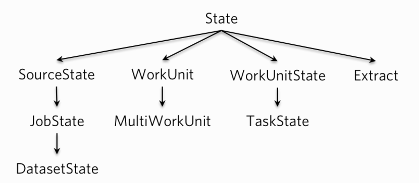

## 一. 简介

Gobblin实在是有太多的state了, 比如SourceState, JobState, DatasetState, WorkUnit等等. 而这些State又跟整个Gobblin的各个阶段密切联系, 所以我独立出一篇文章来理顺下这些State。

本文借鉴了这篇文档[《gobblin-state-deep-dive》](http://gobblin.readthedocs.org/en/latest/user-guide/State-Management-and-Watermarks/#gobblin-state-deep-dive)

下图是Gobblin的类关系, 通过它我们可以对整个State体系有个初步了解:



基类```State```是```Properties```的封装, 并提供了对它的一系列方法。

## 二. SourceState, JobState, DatasetState

### 2.1.SourceState

SourceState主要有几个任务:

1. 包含当前job的配置文件的配置
2. 包含上一个job在StateStore存储下来的State
3. 为Source提供根据Extract生成WorkUnit的方法
4. 提供生成Extract的方法

因此SourceState主要作用阶段在source.

```java
public class SourceState extends State {
    * * *
    /* 上一个job的state */
    private final Map<String, SourceState> previousDatasetStatesByUrns;
    private final List<WorkUnitState> previousWorkUnitStates = Lists.newArrayList();

    /* 创建Extract Statte */
    public synchronized Extract createExtract(Extract.TableType type, String namespace, String table) {
      Extract extract = new Extract(this, type, namespace, table);
      while (EXTRACT_SET.contains(extract)) {
        if (Strings.isNullOrEmpty(extract.getExtractId())) {
          extract.setExtractId(DTF.print(new DateTime()));
        } else {
          DateTime extractDateTime = DTF.parseDateTime(extract.getExtractId());
          extract.setExtractId(DTF.print(extractDateTime.plusSeconds(1)));
        }
      }
      EXTRACT_SET.add(extract);
      return extract;
    }

    /* 根据State创建WorkUnit Statte */
    public WorkUnit createWorkUnit(Extract extract) {
      return new WorkUnit(this, extract);
    }

    * * *
}
```

### 2.2.JobState

JobState在SourceState基础上更进了一步, 它不但包含了SourceState的配置和功能, 更加入了job运行时的配置参数, 比如job ID, 开始时间, 结束时间, 以及job的运行状态等, 以及每个task的TaskState.

```java

public class JobState extends SourceState {

  /**
   * Job运行状态
   */
  public enum RunningState {
    PENDING, RUNNING, SUCCESSFUL, COMMITTED, FAILED, CANCELLED
  }

  private String jobName;   // job运行名字
  private String jobId;     // job id
  private long startTime = 0; // job开始时间
  private long endTime = 0; // job结束时间
  private long duration = 0; // 持续时间
  private RunningState state = RunningState.PENDING; //Job运行状态
  private int taskCount = 0; // task个数
  private final Map<String, TaskState> taskStates = Maps.newLinkedHashMap();// 所有task状态

}
```

因为JobState基本上包含了所有job的运行信息, 所以它的生命周期就是完整的job的生命周期, 特别是在metrics输出信息。

### 2.3.DatasetState

DatasetState在JobState的基础上添加了dataset.urn属性以此来区分不同的dataset。目前主要用在```FsDatasetStateStore```


## 三. WorkUnit, MutliWorkUnit

### 3.1.WorkUnit

WorkUnit主要包含以下几个内容:

1. 包含State即SourceState的所有properties, 这是因为WorkUnit是由Source的```getWorkunits(SourceState)```生成的
2. 包含low watermark和high watermark的数据, 即摄取的数据的摄取范围
3. 包含Extractor，摄取器.

```java

public WorkUnit(SourceState state, Extract extract) {
  // Values should only be null for deserialization
  if (state != null) {
    super.addAll(state);
  }

  if (extract != null) {
    this.extract = extract;
  } else {
    this.extract = new Extract(null, null, null, null);
  }
}

public void setLowWaterMark(long lowWaterMark) {
  setProp(ConfigurationKeys.WORK_UNIT_LOW_WATER_MARK_KEY, lowWaterMark);
}

public void setHighWaterMark(long highWaterMark) {
  setProp(ConfigurationKeys.WORK_UNIT_HIGH_WATER_MARK_KEY, highWaterMark);
}
```
WorkUnit由Source的getWorkunits生成, 主要是为了记录不同task应该摄取哪部分数据.

### 3.2.MutliWorkUnit

MutliWorkUnit继承了WorkUnit, 其实质则是对多个WorkUnit进行了封装以便后续运行在一个task中, 如果MutliWorkUnit包含了所有的WorkUnits, 那么一个job就只会对应一个task。

```java
public class MultiWorkUnit extends WorkUnit {

  private final List<WorkUnit> workUnits = Lists.newArrayList();

  @Deprecated
  public MultiWorkUnit() {
    super();
  }

  * * *
}
```
MutliWorkUnit的出现很好对source的partition进行了补充, 使得它在负载均衡上面得到了很好的提升。如果没有MutliWorkUnit, 那么mapreduce模式下由于partition的不均衡很容易造成数据倾斜. 而MutliWorkUnit的存在使得我们可以通过合并小的WorkUnit的平衡每个map的数据, 降低数据倾斜的风险。

## 四. WorkUnitState, TaskState

### 4.1.WorkUnitState

WorkUnitState不但包含了WorkUnit的所有配置, 也包含了WorkUnit的运行状态以及非常重要的actual high watermark。

```java
public class WorkUnitState extends State {
    public enum WorkingState {
    PENDING,
    RUNNING,
    SUCCESSFUL,
    COMMITTED,
    FAILED,
    CANCELLED
    }
    private WorkUnit workunit;
    public WorkUnitState(WorkUnit workUnit) {
        this.workunit = workUnit;
    }
    public void setActualHighWatermark(Watermark watermark) {
        setProp(ConfigurationKeys.WORK_UNIT_STATE_ACTUAL_HIGH_WATER_MARK_KEY, watermark.toJson().toString());
    }
}
```
> setActualHighWatermark 是在Extractor中初始化时候设置的，它必须赶在readRecord调用前进行set。

### 4.2.TaskState

TaskState在WorkUnitState的基础上加入了task有关的一些信息, 比如task id, task name, start time, end time 等。生命周期贯穿了整个task，类似于job task, 不同之处前者在task level，后者在task level。因此TaskState也会在metrix存储相应的运行信息。

```java

public class TaskState extends WorkUnitState {
    * * *
    private String jobId;
    private String taskId;
    private long startTime = 0;
    private long endTime = 0;
    private long duration;

    public TaskState(WorkUnitState workUnitState) {
        // Since getWorkunit() returns an immutable WorkUnit object,
        // the WorkUnit object in this object is also immutable.
        super(workUnitState.getWorkunit());
        addAll(workUnitState);
        this.jobId = workUnitState.getProp(ConfigurationKeys.JOB_ID_KEY);
        this.taskId = workUnitState.getProp(ConfigurationKeys.TASK_ID_KEY);
        this.setId(this.taskId);
    }

    * * *
}

```

## 五. Extract

Extract对接需要摄入的数据源, 它包含了需要摄入的配置信息, 比如摄入方式(snapshot-only, append-only, snapshot-append), 主键(primary keys), 需要增量的键(delta fields)等等。

相同namespace和table下的Extracts必须有不同的extract ID。 一个或多个WorkUnits可以分享同一个extract ID。 具有相同的extract ID的WorkUnits可以视为同一个Extract的组成部分, 以便使用相同的发布策略。

## 六. 运行过程转换

本小节主要介绍这些state在gobblin运行过程中的关系:

* 当job开始运行时候, job launch首先会创建JobState, 它包含两部分信息, 1) 所有job的配置文件; 2) 上一个job的JobState / DatasetState, 以及其他的配置, 如每个JobState／DatasetState的 actual high watermark等
* Job Launcher 会把JobState(以SourceState的形势)传给Souce, Source根据JobState来创建WorkUnits。当创建WorkUnits时候, JobState不会立马就加载进WorkUnits, 而是在task执行时候才会完成加载。这是因为当laucher运行在单个JVM时候,如果创建大量的WorkUnits且都是JobState copy有可能会出现oom。
* job launcher 准备开始运行WorkUnits。
* 在standalone模式中, job launcher会把JobState添加到每一个WorkUnit, 如果配置已经在WorkUnit中则不会覆盖。对于每一个WorkUnit， job launcher都会创建一个task去运行WorkUnit，并提交所有task到TaskExecutor运行在同一个线程池中。
* 在MR模式下, job laucher会序列化JobState和每一个WorkUnit, 并被mapper所获取。

此时 job launcher 会等待所有task完成。

* 每个task对应一个workunit, 每个task包含一个TaskState。初始化时候，TaskState获取JobState以及workunit所有配置, 运行过程中, 更多的Extractor, Converter 和 Writer的配置, 比如actual high watermark, 会通过Extractor加入到TaskState。
* 当所有Task完成时候, TaskState会根据dataset.urn创建DatasetStates。当dataset的数据提交时候, job launcher就会存下DatasetState。 如果没有dataset.urn, 那么只会有单个DatasetState，并根据提交策略进行提交。

## 七. 总结

最后说下我的理解:

* WorkUnitState包含了WorkUnit的配置以及task运行的状态数据.
* TaskState包含了WorkUnitState和Task的基本信息(id,start time, end time)
* JobState包含配置文件配置, 所有task的TaskState，以及job的基础信息(id, start time, end time)。
* 在初始阶段, WorkUnits由JobState生成。

本文完


* 原创文章，转载请注明： 转载自[Lamborryan](<lamborryan.github.io>)，作者：[Ruan Chengfeng](<http://lamborryan.github.io/about/>)
* 本文链接地址：http://lamborryan.github.io/gobblin-state
* 本文基于[署名2.5中国大陆许可协议](<http://creativecommons.org/licenses/by/2.5/cn/>)发布，欢迎转载、演绎或用于商业目的，但是必须保留本文署名和文章链接。 如您有任何疑问或者授权方面的协商，请邮件联系我。
