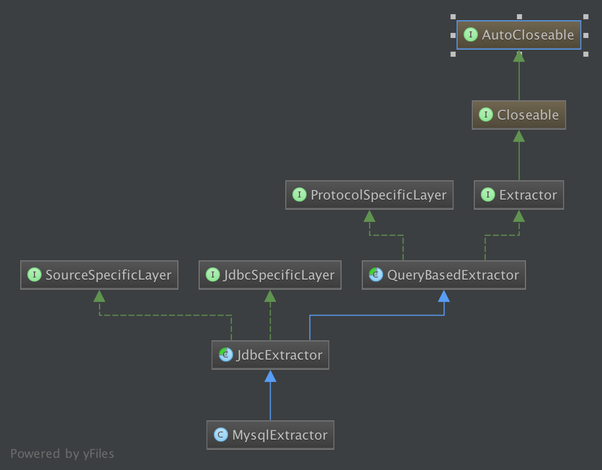

## 一. 简介

Extractor相比Source来说就简单多了, 因为Source不但要考虑当前job的WorkUnits, 还要考虑前一个Job的WorkUnits. 相比之下Extractor的服务对象就单个WorkUnits, 要实现的功能也无非就是根据low water mark和high water mark从数据源那里获取数据。

因此本文主要介绍Extractor如何实现上述描述的功能。目前Gobblin支持且常用的Extractor有MysqlExtractor, KafkaSimpleSource等等, 本文依然以MysqlExtractor为例来介绍Extractor。

## 二. MysqlExtractor的类继承关系。



由此可见, 要实现MysqlExtractor不但需要继承Extractor, 也要继承实现该数据源有关的SpecificLayer接口。

## 三. Extractor接口

现在让我们来看下Extractor接口实现了哪些功能:

* 获取record的数据结构
* 读取record
* 获取record的个数
* 获取可以获取到的high water mark

```java
public interface Extractor<S, D> extends Closeable {

  public S getSchema() throws IOException;

  public D readRecord(@Deprecated D reuse) throws DataRecordException, IOException;

  public long getExpectedRecordCount();

  @Deprecated
  public long getHighWatermark();
}
```

## 四: QueryBasedExtractor

实际上QueryBasedExtractor已经通过ProtocolSpecificLayer的接口实现了Extractor的接口功能。

比如readRecord通过getIterator()来实现迭代器从而获取一条条record。其中getRecordSetFromSourceApi和getRecordSet就是ProtocolSpecificLayer的接口。如此后续要继承QueryBasedExtractor就必须实现ProtocolSpecificLayer的接口。

getRecordSetFromSourceApi和getRecordSet是通过SOURCE_QUERYBASED_IS_SPECIFIC_API_ACTIVE这个配置项来选择的。

```java
/**
 * Get iterator from protocol specific api if is.specific.api.active is false
 * Get iterator from source specific api if is.specific.api.active is true
 * @return iterator
 */
private Iterator<D> getIterator()
    throws DataRecordException, IOException {
  if (Boolean.valueOf(this.workUnit.getProp(ConfigurationKeys.SOURCE_QUERYBASED_IS_SPECIFIC_API_ACTIVE))) {
    return this.getRecordSetFromSourceApi(this.schema, this.entity, this.workUnit, this.predicateList);
  }
  return this.getRecordSet(this.schema, this.entity, this.workUnit, this.predicateList);
}
```

ProtocolSpecificLayer的接口主要是获取数据源的record schema，record数量, data type, 以及获取record等。

```java
public interface ProtocolSpecificLayer<S, D> {
  public void extractMetadata(String schema, String entity, WorkUnit workUnit)
      throws SchemaException, IOException;

  public long getMaxWatermark(String schema, String entity, String watermarkColumn,
      List<Predicate> snapshotPredicateList, String watermarkSourceFormat)
      throws HighWatermarkException;

  public long getSourceCount(String schema, String entity, WorkUnit workUnit, List<Predicate> predicateList)
      throws RecordCountException;

  public Iterator<D> getRecordSet(String schema, String entity, WorkUnit workUnit, List<Predicate> predicateList)
      throws DataRecordException, IOException;

  public String getWatermarkSourceFormat(WatermarkType watermarkType);
  ...

  public Map<String, String> getDataTypeMap();

  public Iterator<D> getRecordSetFromSourceApi(String schema, String entity, WorkUnit workUnit,
      List<Predicate> predicateList)
      throws IOException;
}
```

## 五: JdbcExtractor 和 MysqlExtractor

JdbcExtractor的情况跟QueryBasedExtractor类似, 它继承了QueryBasedExtractor,SourceSpecificLayer,JdbcSpecificLayer, 通过JdbcSpecificLayer和SourceSpecificLayer的接口来实现QueryBasedExtractor中未实现的接口。

而且JdbcExtractor自动将jdbc的数据转换成了json格式。

MysqlExtractor又最后实现了剩余的接口。

## 六: 总结

由于代码比较多, 但逻辑比较简单，所以对Extractor的介绍就简单掠过了。

本文完

* 原创文章，转载请注明： 转载自[Lamborryan](<lamborryan.github.io>)，作者：[Ruan Chengfeng](<http://lamborryan.github.io/about/>)
* 本文链接地址：http://lamborryan.github.io/gobblin-extractor
* 本文基于[署名2.5中国大陆许可协议](<http://creativecommons.org/licenses/by/2.5/cn/>)发布，欢迎转载、演绎或用于商业目的，但是必须保留本文署名和文章链接。 如您有任何疑问或者授权方面的协商，请邮件联系我。
