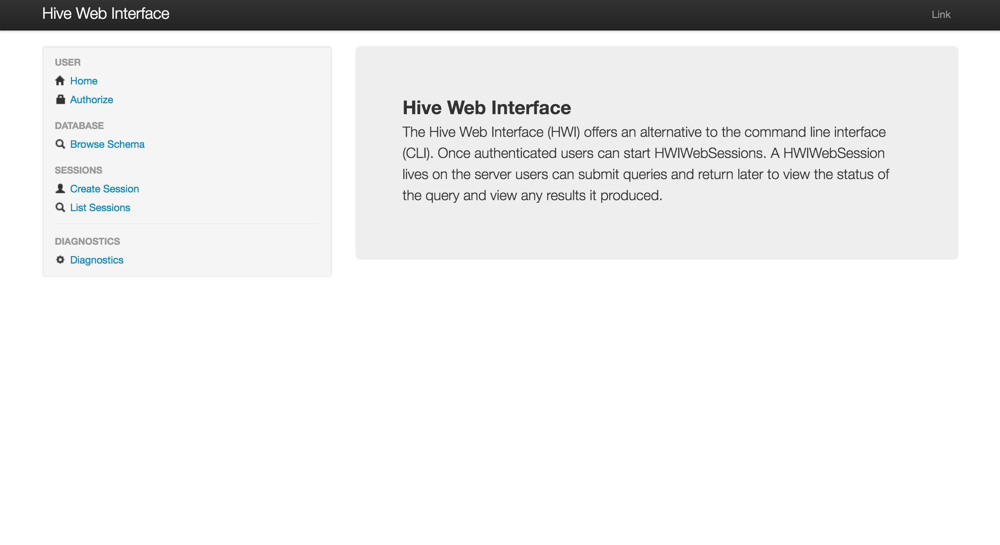

## 一.简介

看源码的时候发现Hive其实自带了Hive Web Interface(HWI)模块, 一时好奇就拿来了安装和配置. 结果弄好之后, 用户体验不太好, 特别是对比了HUE的用户体验。

## 二.配置

### 2.1 war包生成

由于hwi是在jetty的容器内运行的，所以需要配置个war包。我使用的hive是1.2.1版本，默认的发布版本是不带有war包的(以前的低版本是有的).所以如果你的版本的lib目录下没有war包, 你需要下载源码并自己打包war, 以下是打包操作, HIVE_SRC是hive的源码根目录。
``` shell
cd $HIVE_SRC/hwi/web
jar cvf hive-hwi-1.2.1.war ./*
```
将war包扔到$HIVE_HOME/lib下

### 2.2 配置hive－site.xml

```xml
<property>
<name>hive.hwi.war.file</name>
<value>lib/hive-hwi-1.2.1.war</value>
</property>
</configuration>
```
注意这里的路径设置, hive会在hive.hwi.war.file路径前加入hive的根目录, 所以实际路径是$HIVE_HOME/lib/hive-hwi-1.2.1.war

```xml
<property>
<name>hive.hwi.listen.host</name>
<value>0.0.0.0</value>
</property>
<property>
<name>hive.hwi.listen.port</name>
<value>9999</value>
</property>
```

这两个配置可以不去修改, 以上的值是默认值, 当然也可以在下节启动命令中加入这两配置。

### 2.3 启动并访问hive-hwi service

```shell
bin/hive --service hwi
```

然后可以访问```localhost:9999/hwi``` 了



### 2.4 有可能遇到的错误

如果访问出现以下错误：

``` shell
Problem accessing /hwi/. Reason:
    Unable to find a javac compiler;
com.sun.tools.javac.Main is not on the classpath.
Perhaps JAVA_HOME does not point to the JDK.
It is currently set to "/usr/java/jdk1.7.0_55/jre"
```

则只需要以下步骤:

```shell
cp /usr/java/jdk1.7.0_55/lib/tools.jar  $HIVE_HOME/lib
```

### 3. 总结

虽然本文介绍了如何配置hive-hwi, 但是由于使用不方便, 所以日常不会有人使用. 还是使用hue好，本文纯属无聊之作。

本文完
